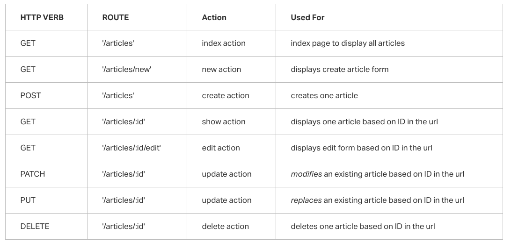

# Intro to Sinatra and MVC

## Goals

- [ ] What does the Sinatra file/folder structure look like
- [ ] How and why we use the MVC pattern
- [ ] How CRUD actions map to RESTful routes
- [ ] (How to make an HTML form)

## [Sinatra](https://www.youtube.com/watch?v=qQzdAsjWGPg)

- _What do we mean by "convention over configuration?"_
- A DSL sitting on top of Ruby and Rack
- `corneal` - Ruby gem that is a Sinatra app generator with Rails-like simplicity (to implement basic directory structure of MVC App in Sinatra)
- `shotgun` - Ruby gem that makes it easier to develop and test Rack-based Ruby web applications locally by starting Rack with automatic code reloading
- _What does `class Game < ActiveRecord::Base` do for us?_
- `class ApplicationController < Sinatra::Base`
- ERB templates
  - `<%= %>` vs `<% %>`
  - `<%= yield %>`
- File/folder structure
  - `Rakefile` - file for our rake tasks
  - `Gemfile` - gems used in this application
  - `config.ru` - the runner file (detail to Rack the environment requirements of the application and start the application)
  - `spec` folder - test files
  - `public` folder - holds our front-end assets, additional files like images/js/css
  - `db` folder - migration files and database
  - `config` folder - environment file that sets up database connection and requires files
  - `app` folder - models/views/controllers (MVC)

## Model View Controller

- One of many common programming architectural paradigms
- _Why separate things out?_
- What are the different parts of MVC?
  - Model = Data
    - Represents the data and nothing else
    - Interacts with database
    - Independent of view or controller
  - View = Interface
    - Displays data through controller
    - Sends user actions to controller
    - Independent of model and controller
  - Controller = Go-Between
    - Provides model data to view
    - Interprets user actions
    - Dependent on model and view
- MVC pattern is like a restaurant...
- Why?
  - Agree on logic/pattern so others can read and use our code
    - A lot of a developer's job is dealing with other people's code
    - Minimize time spent figuring out how to talk to app
  - Separation of concerns
  - Security and access control
  - Simplify views, tailor user experience

## REST (REpresentational State Transfer)

- Another convention
- RESTful routes provide a design pattern that allows for easy data manipulation (It’s nicer for users and nicer for developers to have everything consistent)
- URL represents state of the data
  - `https://www.espn.com/nba/team/_/name/gs/golden-state-warriors`
  - `https://www.espn.com/nba/player/_/id/1966/lebron-james`
- Many of the CRUD actions are different actions that occur on the same resource
  
  
- REST methods minimize URLs, maximize functionality
- HTTP requests are stateless

### Resources

[Config Setting](http://sinatrarb.com/configuration.html)
