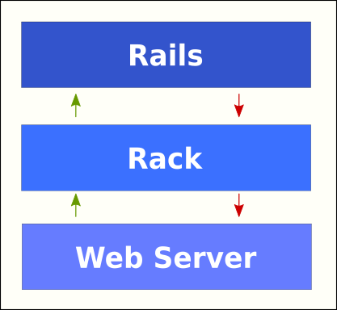
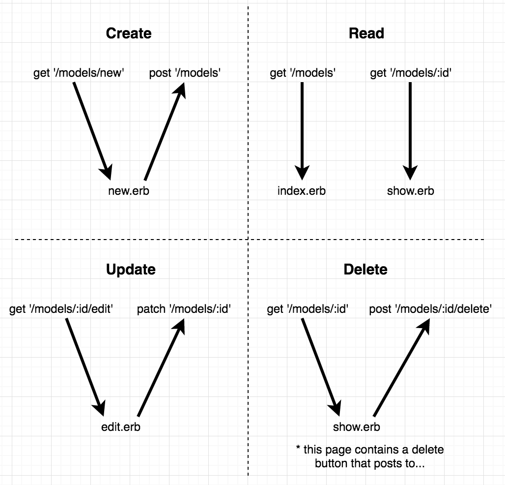

# Sinatra Forms and REST

## Goals

- [ ] Review
  - [ ] Rake
  - [ ] Rack
  - [ ] Shotgun
  - [ ] Sinatra
  - [ ] CRUD
  - [ ] REST
- [ ] Implementation of RESTful Routing & HTML forms
- [ ] Render vs. Redirect

## Review

### Rake

- Task runner
- We can create our own tasks or use tasks that other frameworks provide to us e.g. `sinatra/activerecord/rake`

### Rack

- Interface between the web server and the web framework (it allows those two to communicate)
  

- Benefits

  - Rack allows us to use different frameworks (Sinatra, Rails) & servers (Puma, Thin) interchangeably
  - The web server doesn't need to know about the framework and vice versa
  - Rack sits in the middle of every web request & response, which means it can denying access to unwanted requests, keep track of slow responses etc.

Technically there is no difference between "use" and "run". "run" is just there to illustrate that it's the end of the chain. (run/use methods come from Rackup)

### Shotgun

- Automatic reloading of server for Rack based applications
- It starts one of Rack's supported servers (e.g., puma, thin) and listens for requests and changes

### Sinatra

- A DSL (Domain Specific Language) for quickly creating web applications in Ruby
- Lightweight version of Rails

### CRUD (Create, Read, Update, Delete)

- You can perform the CRUD actions using ActiveRecord
  

### REST (Representational State Transfer)

- RESTful routes provide a design pattern that allows for easy data manipulation (It’s nicer for users and nicer for developers to have everything consistent)
- Many of the CRUD actions are different actions that occur on the same resource
  
  

### Corneal

- A Ruby gem that is a Sinatra app generator with Rails-like simplicity (to implement basic directory structure of MVC App in Sinatra)

## Implementation of RESTful Routing

- `Index`
- `Show`
- `New`
- `Edit`
- `Delete`

## Render vs. Redirect

### Render (`erb`)

- The `erb` syntax allows you to render partials, it knows to look in our views folder to render a certain view
- You can pass information via `instance variables` to your views from the controller
- `erb` does NOT create a new `get` request instead it's a reference to a file that will load in the browser

### Redirect (`redirect`)

- A redirect will make a separate http request to the server
- Does not allow for `instance variables` to be passed along

### When to use each one

General rule of thumb: If it’s a _successful_ `post`, `patch`, `delete`, or an _unsuccessful_ `get` do a redirect (otherwise render)

Things to keep in mind:

1. Don’t make a new HTTP request when not necessary
2. Remember that a “render” doesn't change the url of the page, make sure the urls make sense to the user when you use render.
3. When we submit a form successfully we want to redirect to prevent resubmission of that form
