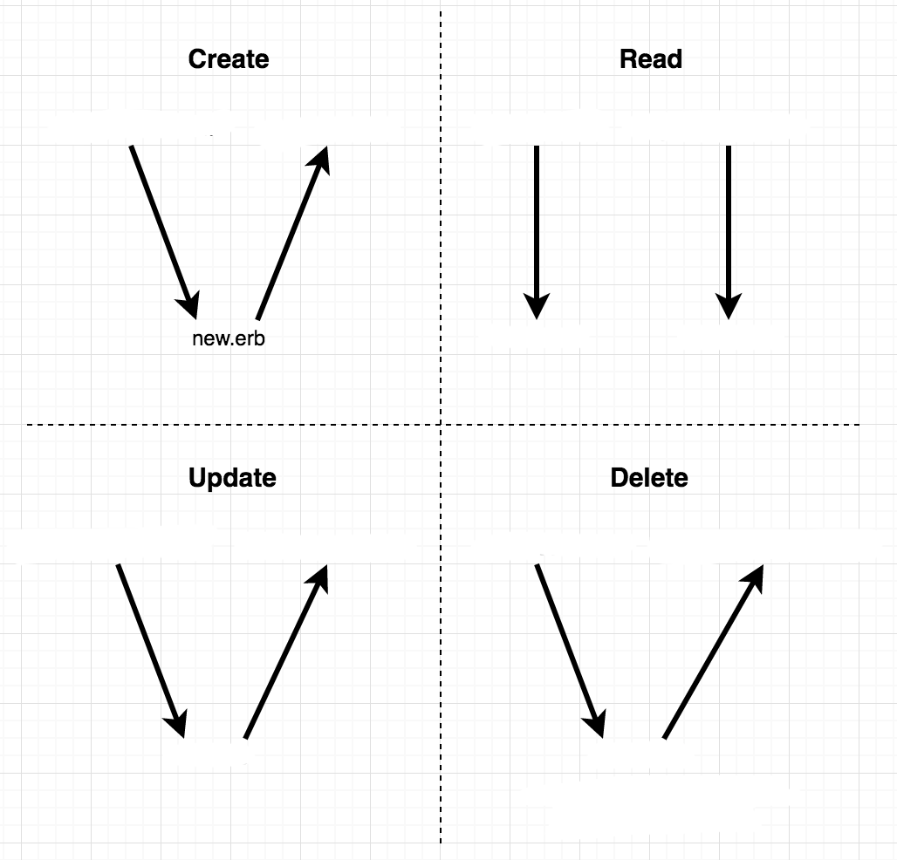

# Sinatra Forms with Associated Objects

## Goals 🐲

- [ ] Review CRUD in the context of web applications 🛠
- [ ] Review REST 🧮
- [ ] Implement RESTful routing 🛤
- [ ] Build a form for creating an object with associations 🕸

## CRUD 🛠

- ⚠️ _**What is CRUD?**_
  

## REST 🧮

- ⚠️***What is REST?***

## Implementation of RESTful Routing 🛤

- Read
  - `#index`
  - `#show`
- Create
  - `#new`
    - HTML `form`s need `action` (where) and `method` (how) attributes
    - `input`s need `type`s (of input data), `name`s (aka keys), and `ic`s (for CSS and JS targetting)
      - In Sinatra, `params` hold `name`:`value` pairs
    - [What's a `label`?](https://developer.mozilla.org/en-US/docs/Web/HTML/Element/label)
  - `#create`
- Update
  - `#edit`
    - Hidden inputs help us pass settings and data through forms
      - `<input type="hidden" name="_method" value="patch">`
      - `Rack::MethodOverride`
  - `#update`
- Delete
  - `#delete`

### Render vs. Redirect

#### Render (`erb`)

- `erb` syntax allows you to render partials
- Knows to look in views folder to render a certain view
- Pass information via `instance variables` to your views from the controller
- `erb` does NOT create a new `GET` request; instead it's a reference to a file that will load in the browser

#### Redirect (`redirect`)

- A redirect will make a separate http request to the server
- Does not allow for `instance variables` to be passed along

#### When to use each one

General rule of thumb: If it’s a _successful_ `post`, `patch`, `delete`, or an _unsuccessful_ `get` do a redirect (otherwise render).

Things to keep in mind:

1. Don’t make a new HTTP request when not necessary
2. Remember that a “render” doesn't change the url of the page, make sure the urls make sense to the user when you use render.
3. When we submit a form successfully we want to redirect to prevent resubmission of that form

## Associated Objects 🕸

- Model Relationships
  - A game has many reviews.
  - A review belongs to a game.
- Nested forms
  - Use to create an instance _and_ a relationship
  - Nested forms => nested params
- Nested forms in Sinatra
  ⚠️ \_\*\*What will `name = game[reviews][][content]` look like in params?
  - `params#except`
  - When `Model.new` and `Model.save` are useful

## Takeaways ⛹🏽‍♀️

- [ ] RESTful routes map CRUD actions to HTTP methods
- [ ] HTML elements and attributes are essential to writing clean, accessible code
- [ ] The `erb` method renders a template; `redirect` triggers another HTTP request and controller action.
- [ ] Nested forms are needed when created an instance and a relationship simultaneously.
